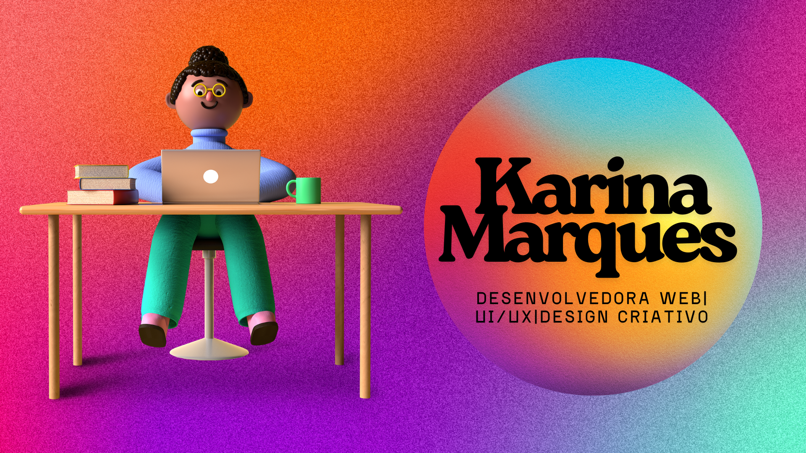

<h3>👩‍💻 OLÁ, EU SOU KARINA 👋</h3>

  
  
  

  

---
## 💡 About Me
Sou desenvolvedora web e designer UI/UX apaixonada por tornar a tecnologia mais humana, acessível e significativa.  
Gosto de criar experiências digitais que unem funcionalidade, estética e propósito.

> Acredito que a tecnologia deve conectar pessoas — não apenas sistemas.

- 🔭 Atualmente estou trabalhando em projetos pessoais e freelancers focados em desenvolvimento web e design  
- 🌱 Atualmente estou aprendendo **UI/UX avançado, desenvolvimento frontend e novas tecnologias**  
- 🤝 Estou aberta a colaborar em projetos criativos e de impacto  
- 💬 Pergunte-me sobre **UI/UX, desenvolvimento web, design e experiência do usuário**  
- 📫 Como me encontrar: **karina.devjourney@gmail.com**  

## 🎯 Tech Stack
📚 **Estudos de interesse Atuais**  
UX/UI Design | Interfaces Digitais | Front-end | Desenvolvimento Web | Full Stack (em formação) | Criação de Produtos Digitais

🚀 **Estudos de interesses Futuros**  
Design Systems | Acessibilidade | Performance Web | Interfaces Interativas | Product Design | IA Aplicada | Automação

## 🛠 Tech Stack

<b>💻 Linguagens de Programação</b>

 

<b>🎨 Front-end</b>

 

<b>⚙️ Back-end</b>

 

<b>🗄️ Banco de Dados</b>

 

<b>⚙️ Ferramentas</b>

 

## 📫 Contact

- LinkedIn: https://www.linkedin.com/in/karina-s-marques
- Email: karina.devjourney@gmail.com

---  
